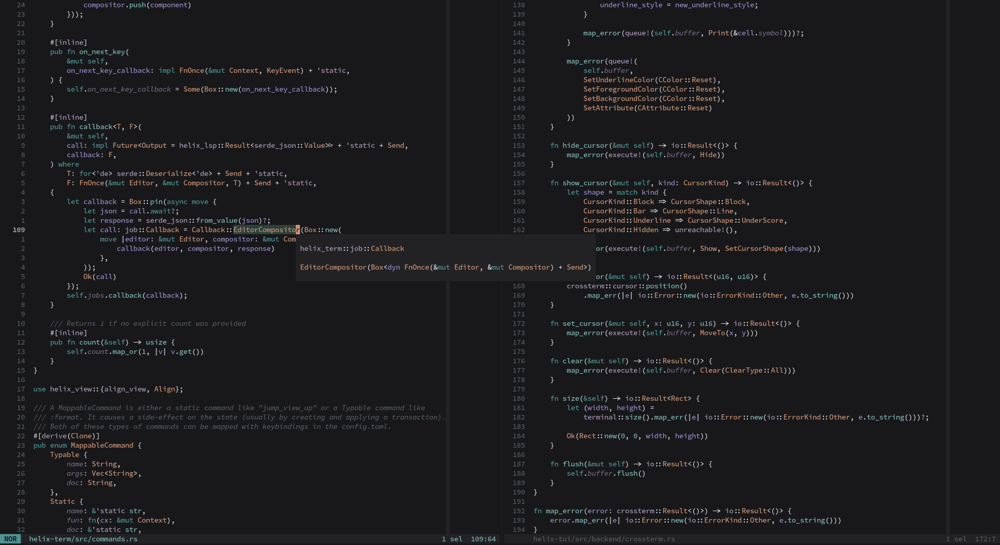
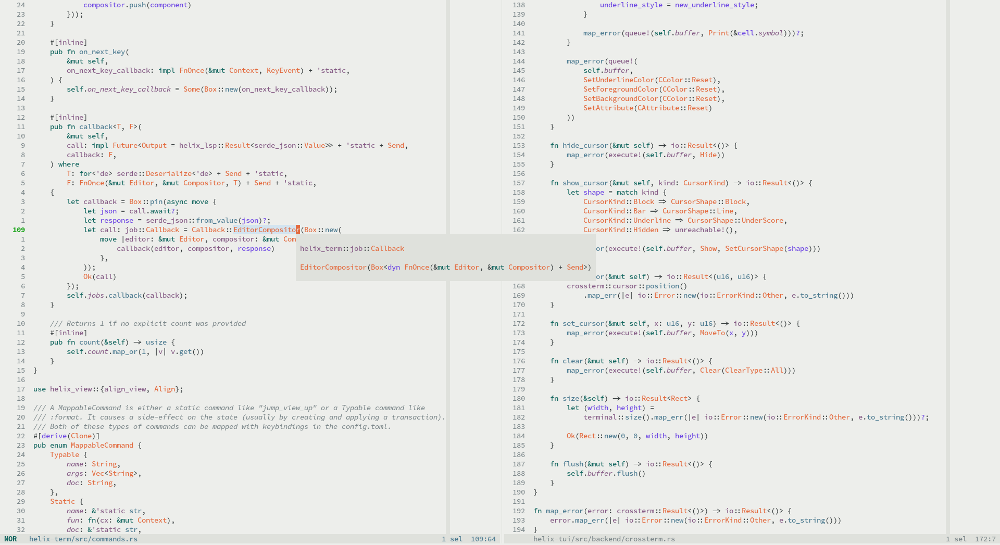
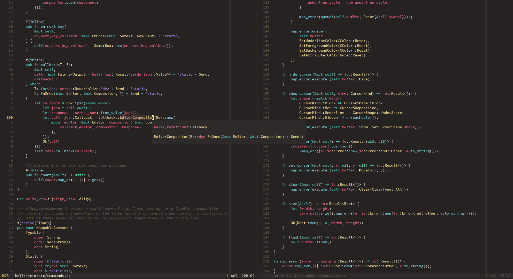

# Kaolin themes for the Helix Editor
This is my take on porting some variations of the nice [Kaolin themes](https://github.com/ogdenwebb/emacs-kaolin-themes) to use with [Helix](https://github.com/helix-editor/helix).

### Variations

  
Kaolin Dark theme

   
  
  

  
Kaolin Light theme

   
  
  

  
Kaolin Valley Dark theme

   
  
  

Original themes: 
